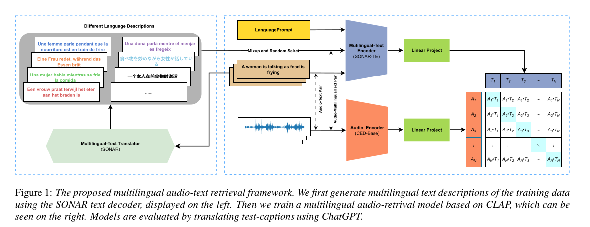

# ML-CLAP

This repo is the source for the Interspeech 2024 Paper [Bridging Language Gaps in Audio-Text Retrieval](https://arxiv.org/abs/2406.07012). 




# create env
```
   conda create -n ml-clap python=3.10
   conda install -c conda-forge libsndfile==1.0.31
   pip install -r requirements.txt 
```
# pack json  to wds
```
   bash run_json_to_wds.sh data/AudioCaps/test.json data/AudioCaps/tar/test
```
# wget resource
```
   wget -P data/AudioCaps/ https://zenodo.org/records/13358171/files/audiocaps_test.tar.gz
   wget -P data/Clotho/ https://zenodo.org/records/13358171/files/clotho_test.tar.gz
   wget -P infer_models/ https://zenodo.org/records/13358171/files/pretrain.pt
```
# test
```
   python infer.py -c config/pretrain.yaml
```
